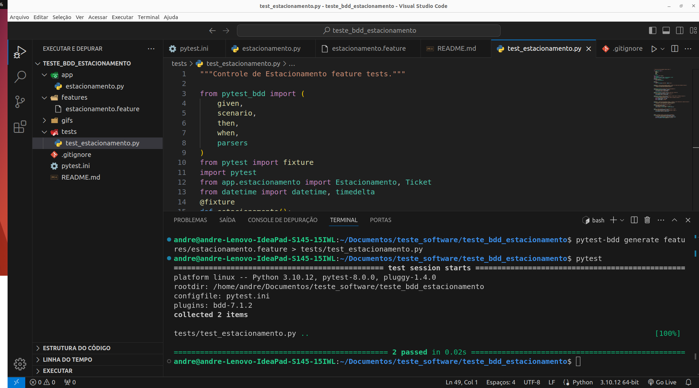

# Dependências
- [Python 3](https://www.python.org/)   

- [Pytest](https://pypi.org/project/pytest/)  
```
pip install pytest
```

- [Pytest-bdd](https://pypi.org/project/pytest-bdd/)  
```
pip install pytest-bdd
```  

- Para executar o teste executa o comandos pytest / pytest -v  
**pytest** imprime o resultado no console.  
**pytest -v** imprime o resultados dos cenários do bdd separados no console.
```
pytest
```  
ou 
```
pytest -v
```

## Teste unitário.
### Testar feature de um estacionamento.
### Passo 1
- Testar a entrada de veiculo no estacionamento  
### Passo 2
- Testar valor a pagar na saída do veículo.  

### Resultado.
- Segue um exemplo após rodar o teste.  
|

