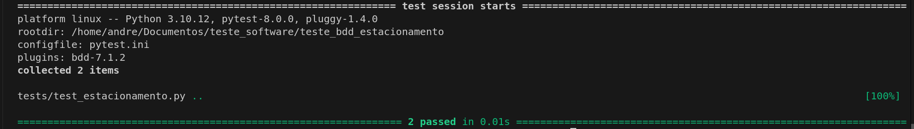
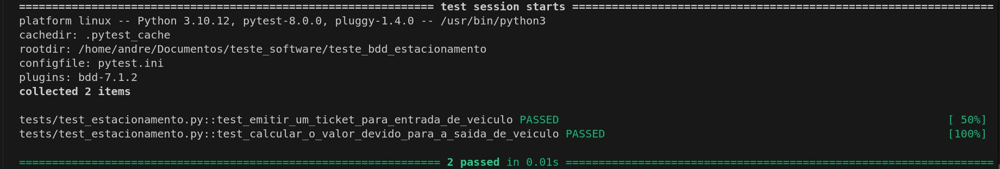

# Sistema de Controle de Estacionamento

Este projeto é um sistema de controle de estacionamento que permite registrar a entrada e saída de veículos, além de calcular o valor devido com base no tempo de permanência.

## Funcionalidades

- **Emitir Ticket:** Ao entrar no estacionamento, um ticket é emitido contendo as informações do veículo e a hora de entrada.
- **Registrar Saída:** Ao sair do estacionamento, a hora de saída é registrada no ticket.
- **Calcular Valor Devido:** O sistema calcula o valor a ser pago com base no tempo de permanência do veículo.

## Regras de Cálculo

- A primeira hora de estacionamento custa **R$ 15,00**.
- Cada hora adicional (ou fração) custa **R$ 5,00**.

## Estrutura do Projeto

- **Código Principal:** O código principal está na classe `Estacionamento`, que gerencia os tickets, e na classe `Ticket`, que armazena as informações do veículo.
- **Testes Unitários:** Os testes são implementados utilizando `pytest` e `pytest-bdd` para garantir que o sistema funciona conforme esperado.
- **Features:** O comportamento esperado do sistema é descrito em arquivos `.feature`, seguindo a sintaxe Gherkin.

## Como Executar

### Pré-requisitos

- Python 3.8+
- `pytest` e `pytest-bdd`

### Instalação

1. Clone o repositório:
   ```bash
   git clone https://github.com/seu-usuario/seu-repositorio.git
   ```  
## Resultados dos Testes

### Executando os Testes Padrão

Ao executar o comando:

```bash
pytest
```
Os testes unitários, indicando quais testes passaram ou falharam.  
Segue exemplo:
|
### Executando os Testes em Modo Verbose

Ao executar o comando:

```bash
pytest -v
```
No modo verbose, você verá informações detalhadas sobre cada teste, com o nome do teste, o resultado, e o tempo de execução.  
Segue exemplo:
|
